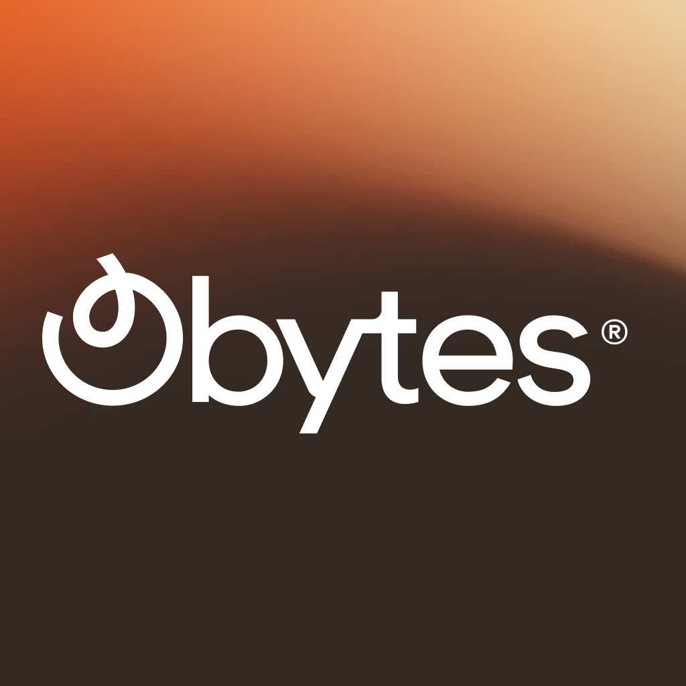

<h1 align="center">
  <br/>
Mobile App </h1>

## 🔗 Requirements

## Requirements

- [React Native dev environment ](https://reactnative.dev/docs/environment-setup)
- [Node.js LTS release](https://nodejs.org/en/)
- [Git](https://git-scm.com/)
- [Watchman](https://facebook.github.io/watchman/docs/install#buildinstall), required only for macOS or Linux users
- [Yarn](https://classic.yarnpkg.com/en/docs/install)
- [Expo Cli](https://docs.expo.dev/workflow/expo-cli/)
- [VS Code Editor](https://code.visualstudio.com/download) ⚠️ Make sure to install all recommended extension from `.vscode/extensions.json`

## 👋 Quick start

Clone the repo to your machine and install deps :

```sh
git clone https://github.com/97Fakhreddine/f-resto.git

cd ./f-resto

yarn
```

To run the app on ios

```sh
yarn ios
```

To run the app on Android

```sh
yarn android
```

Clone Backend repo and install all dependencies.

go to https://github.com/97Fakhreddine/b-resto.git
